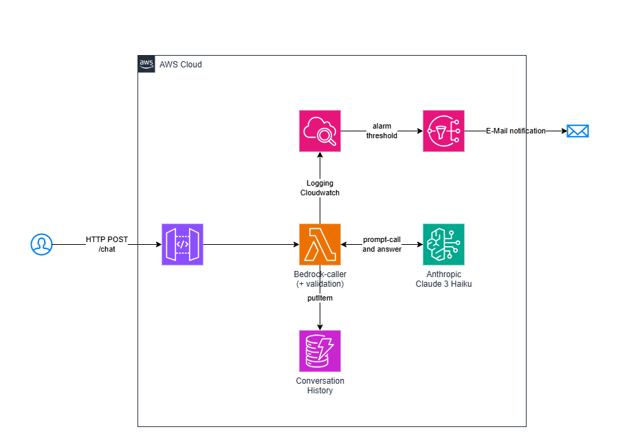

# 🤖 AI Service Bot – Serverless Customer Support with Amazon Bedrock

This project implements a **rule-based, AI-powered customer service chatbot** using **Amazon Bedrock (Claude 3 Haiku)**. The architecture is fully **serverless** and follows the **AWS Well-Architected Framework**, focusing on **Operational Excellence**, **Security**, **Reliability**, and **Performance Efficiency**.

---

## 🧠 Architecture Overview

  

## 🚀 Current Functionality (Phase 6)

- API Gateway-based chat endpoint (`/chat`)
- Invocation of Claude 3 Haiku via Amazon Bedrock
- Response validation and modification using `rules.json` (e.g., routing, support links)
- Conversation history stored in DynamoDB
- CloudWatch monitoring (errors & latency) with SNS alerts

---

🛠️ Technologies & AWS Services

Amazon API Gateway

AWS Lambda (Node.js 18.x)

Amazon Bedrock (Claude 3 Haiku)

Amazon DynamoDB

Amazon CloudWatch

Amazon SNS

AWS CDK (TypeScript)

🧪 Sample Request

curl -X POST https://<API-ID>.execute-api.eu-central-1.amazonaws.com/prod/chat \
  -H "Content-Type: application/json" \
  -d '{ "prompt": "What is the meaning of life?" }'

📦 Deployment
Prerequisites

AWS CLI configured
AWS CDK installed (npm install -g aws-cdk)
Amazon Bedrock enabled in region eu-central-1

## Useful commands

* `npm run build`   compile typescript to js
* `npm run watch`   watch for changes and compile
* `npm run test`    perform the jest unit tests
* `npx cdk deploy`  deploy this stack to your default AWS account/region
* `npx cdk diff`    compare deployed stack with current state
* `npx cdk synth`   emits the synthesized CloudFormation template

🔥 Author
Florian Jedamzik
Cloud Architect & AWS Enthusiast